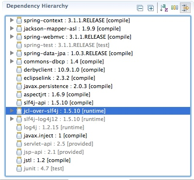

## The Good, the Bad and the Ugly

As promised in [part 2](/doc/02.md) of this series it's now time to have a closer look at the Granny application in order to get a better understanding of its design. After all, that seems to be the most natural thing to do, because how could we otherwise improve it and make it more enterprisey?

### The Basics

Let's start with looking at the general architecture/design of the original Granny project. It's relatively simple (in a positive way!), which makes it easy to understand (and improve). Everybody knows the purpose of an address book and hence we can focus on the implementation details without having to worry about complicated business logic. Another reason I picked this particular application was that it is [Maven](http://maven.apache.org/)-based and using the [Spring](http://www.springsource.org/spring-framework) framework. Let's talk about these two aspects for a minute before we take a look at the functional aspects, shall we?

#### Maven

For those who don't Maven, let's quickly explain what this is all about. When developing applications you usually don't want to re-invent the wheel all the time, but rather concentrate on your specific use-case. As such, it makes total sense to make use of existing frameworks and libraries. This is one of the biggest assets for a Java developer: the large community and a great selection of ready-to-use open source projects.

Now, the tricky part is that all those open-source projects are depending on other libraries as well, which may result in a complex dependency tree. Now imagine you would have to manually work through this dependency hierarchy and get all the required dependencies yourself!?! This is the problem space that Maven is addressing: it greatly simplifies the dependency and build management of applications. Here's what the Maven team has to say about their motivation:

> [Maven] can be used for building and managing any Java-based project. We hope that we have created something that will make the day-to-day work of Java developers easier and generally help with the comprehension of any Java-based project.

[[http://maven.apache.org/what-is-maven.html](http://maven.apache.org/what-is-maven.html "http://maven.apache.org/what-is-maven.html")]

The magic of Maven is a simple configuration file, called `pom.xml` (Project Object Model). I usually describe it by comparing it to a cooking recipe. It consists of three parts: the repositories (think of it as grocery stores), dependencies (the ingredients) and build instructions (the cooking instructions). As such, it's really easy to share projects and make sure that other people can get them up and running with ease! (If only that would be true for cooking as well!)

##### Related information

* [Essentials - Working with Git &amp; Maven in Eclipse](http://scn.sap.com/community/developer-center/cloud-platform/blog/2012/11/02/essentials--working-with-git-maven-in-eclipse)
* [Feature of the Week - Maven-ized Samples](http://scn.sap.com/community/developer-center/cloud-platform/blog/2012/08/02/feature-of-the-week--maven-ized-samples)

#### Spring

I assume that seasoned Java developers have heard about Spring already, yet as this series is also targeting people who are new to open source Java development it makes sense to briefly talk about it me thinks.

Spring has been one of the most popular and most influential open source projects ever in the Java world. It revolutionized the way developers think about good design principles and greatly influenced the future of Java by demonstrating that a more light-weight component model and concepts like [Dependency Injection](http://en.wikipedia.org/wiki/Dependency_injection) (DI) and [Inversion of Control](http://en.wikipedia.org/wiki/Inversion_of_control) (IoC) help tremendously to take the pain out of server-side Java programming. Ultimately, the completely redesigned Enterprise Java Beans (EJB) Version 2.0 adopted these concepts.

(If none of the aforementioned concepts are known to you, don't worry! I said we take it easy and you'll get to see these techniques in action as we move along. However, if you got curious I can strongly recommend the brilliant [Spring documentation](http://static.springsource.org/spring/docs/3.2.x/spring-framework-reference/html/). For me, it has been an eye-opener back in the days...)

**Note**: Lately, there has been quite some discussions in the community whether or not it still makes sense to opt for Spring or whether the EJB 2 standard (which has greatly matured since Spring was invented) is the better choice (see [here](http://bill.burkecentral.com/2012/03/13/java-ee-wins-over-spring/)). I just bring this up because it illustrates that there is no such thing as the ultimate tool or framework, hence you may be interested in such discussions in order to get a better understanding of the bigger picture. At the end of the day, it's you to have to make the decision of which frameworks and libraries to use. Still, I think it makes a lot of sense to familiarize with Spring due to its popularity and wide spread.



#### A closer look

With that out of the way, let's dissect the application. Hey and why not start by looking at the [pom.xml](https://github.com/SAP/cloud-enterprise-granny/blob/master/pom.xml) file to see what components are in the mix?

First of all, you'll notice that there are several spring related modules defined here:

* `spring-context `
* `spring-webmvc `
* `spring-test `
* `spring-data-jpa `

The names are pretty self-explanatory; in a nutshell, we got the core spring framework (spring-context), the [MVC](http://en.wikipedia.org/wiki/Model%E2%80%93view%E2%80%93controller) framework for the UI, the spring test integration framework and a great little gem called: spring-data-jpa. We'll get to talk about the last one in more detail in just a minute.

Then we got a couple of persistence-related libraries:

* `commons-dbcp ` (Apache Commons, [DB Connection Pool](http://commons.apache.org/proper/commons-dbcp/))
* `derbyclient ` (Derby JDBC driver for local testing)
* `eclipselink ` (EclipseLink JPA Provider)
* `javax.persistence` (The JPA API)

There's also a couple of dependencies defined for logging:

* `slf4j-api`
* `slf4j-log4j12`
* `jcl-over-slf4j`
* `log4j `

In short, [slf4j](http://www.slf4j.org/) is a very common wrapper of several logging standards and the project uses the [log4j](http://logging.apache.org/log4j/1.2/) implementation. We'll deal with logging in our next installment, hence I'll skip a more detailed explanation at this point.

So, what's left? There are a couple of standard libraries defined for web applications. Please also note that these are greyed-out and defined with a "provided" [scope](http://maven.apache.org/pom.html), which indicates that these libraries do not need to be bundled with the app as they are provided by the container during runtime.

* `servlet-api`
* `jsp-api`
* `jstl`

Which leaves a couple of dependencies that may deserve a closer look:

* `jackson-mapper-asl`
* `aspectjrt`
* `javax.inject`
* `junit`

Jackson is a very powerful library that deals with data binding (e.g. converting Java objects into JSON format and vice versa). It's one of my favorite open source projects as it really provides a lot of functionality and comes with a good set of defaults that makes it easy to get started. [AspectJ](http://eclipse.org/aspectj/) is an [AOP](http://en.wikipedia.org/wiki/Aspect-oriented_programming) framework for Java and it helps to write modular Java applications by providing means to "out-source" [cross-cutting concerns](http://en.wikipedia.org/wiki/Cross-cutting_concern). (We'll see this in action in the next installment!) [javax.inject](http://docs.oracle.com/javaee/6/api/javax/inject/package-summary.html) is a very light-weight API that caters to our dependency injection needs. Last, but not least, an evergreen: [jUnit](http://junit.org/). Every good Java developer should know about and use JUnit. Period.

### The Good

There are plenty of good things about the original Granny application I'd like to point out. Let's start by mentioning the [convention over configuration](http://en.wikipedia.org/wiki/Convention_over_configuration) approach: instead of bloating up the configuration the developers sticked to general conventions, which helps to keep the clean simple and easy-to-read. Take a look at the application configuration file for example ([app-context.xml](https://github.com/SAP/cloud-enterprise-granny/blob/master/src/main/resources/META-INF/spring/app-context.xml)). Instead of defining every single bean in here, they made use of [component-scanning](http://static.springsource.org/spring/docs/3.0.0.M3/reference/html/ch04s12.html) (line 13) and defined the [CRUD](http://en.wikipedia.org/wiki/CRUD) managers via the `jpa:repositories` declaration (line 15). Speaking of which, this is probably the most interesting aspect of the whole application - the usage of the [spring-data-jpa](http://static.springsource.org/spring-data/data-jpa/docs/current/reference/html/) module!

Here's an abstract of their introduction:


> Implementing a data access layer of an application has been cumbersome for quite a while. Too much boilerplate code had to be written. Domain classes were anemic and not designed in a real object oriented or domain driven manner.

> Using both of these technologies makes developers life a lot easier regarding rich domain model's persistence. Nevertheless the amount of boilerplate code to implement repositories especially is still quite high. So the goal of the repository abstraction of Spring Data is to reduce the effort to implement data access layers for various persistence stores significantly.

As stated above, traditionally developers would have to write a lot of boilerplate code to create CRUD operations and other data access operations such as queries etc. No more! With spring data, all you would need to do is to define a single interface `Repository` specifying the class of the domain object and the class of its primary key via generics (see [AddressRepository](https://github.com/SAP/cloud-enterprise-granny/blob/master/src/main/java/com/osintegrators/example/AddressRepository.java)). The implementation class will be auto-magically provided during runtime.

```java

package com.osintegrators.example;

import java.util.List;

import org.springframework.data.repository.CrudRepository;

public interface AddressRepository extends CrudRepository<Address, Long>
{
    List<Address> findAll();
}

```

The rest is rather basic stuff, make sure to have a look at the only package and familiarize yourself with the other classes. If you should have specific questions, please leave a comment below so that we can discuss it.

### The Bad

Hm, those who have looked at the only domain model object [Address](https://github.com/SAP/cloud-enterprise-granny/blob/master/src/main/java/com/osintegrators/example/Address.java) will probably have noticed that... how to put it... the model is rather basic (to put it nicely!) We only have five attributes: id, name, address, phone and email. Now, that certainly does not meet our expectations and hence we will make this a lot cleaner as we move along. While we are at it, we will also address topics like auditing and database migration and talk about some best practices when in regards to naming conventions etc.

While I do like the fact that the Granny app provides a [RESTful](http://en.wikipedia.org/wiki/RESTful) service interface (aka API) and hereby decouples the presentation layer from the service layer there are mainly two things that I dislike about the solution:

1.  it's using the proprietary spring web annotations instead of using the standard [JAX-RS API](http://en.wikipedia.org/wiki/JAX-RS)
2.  the API does not really qualify as demonstrating best practices when it comes to both REST and API design (see [REST APIs must be hypertext-driven](http://roy.gbiv.com/untangled/2008/rest-apis-must-be-hypertext-driven))

We'll look into these aspects (and fix them) a bit later down the road. Which brings us to the last topic for today...

### The Ugly

OK, I'm not a great designer myself, but the user interface of the Granny app as-is is AHEM... ugly. A more politically correct term may be: "_there's room for improvement!_" And that is equally true for both the way it looks (and feels), but also for how it is implemented (inline CSS? &lt;shiver /&gt;) So, yes... we may want to fix that as well as introduce some neat features like [responsive design](http://en.wikipedia.org/wiki/Responsive_design) and [progressive enhancements](http://en.wikipedia.org/wiki/Progressive_enhancement).

So, with that I have touched upon some of the improvements I've planned for this series, but that is by no means an exclusive list. We'll definitely also discuss other areas and if you should be interested in specific topics please let me know!

In the next installment we'll talk about logging, exception handling and aspect-oriented programming... hope to see you around!
