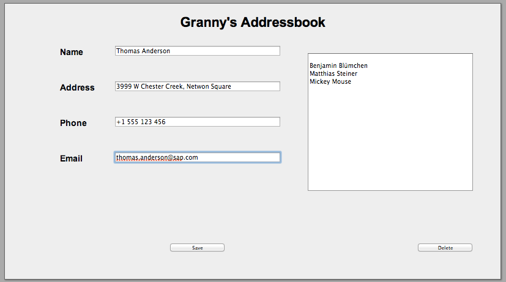
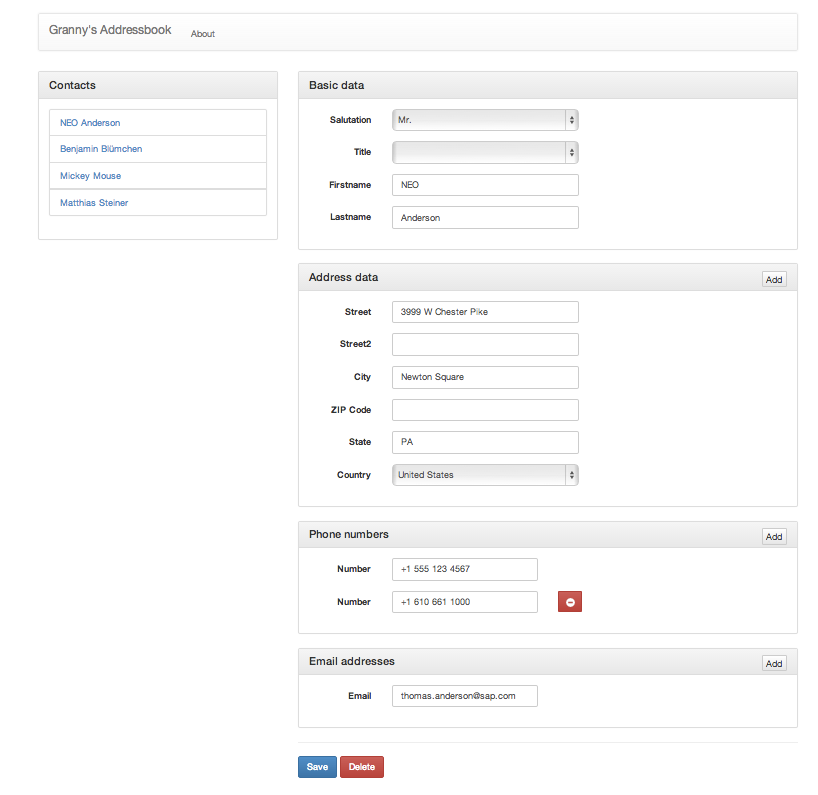

## Inner beauty 

Several weeks have passed since the [last post](/doc/07.md) in this series and so I guess it's about time that we continue our little project here, don't you think? And why not pick up where we left off and bridge that gap between service layer and user interface? Sounds like a plan?

As you may remember from my [assessment blog post](/doc/03.md) the UI of the original application wasn't really appealing neither from an aesthetic nor and functional point of view. While the first may lay in the eye of the beholder and one could argue that a _good-looking_ user interface is not really required for a sample application, the second point really needs to be fixed. Fortunately fixing the later also enables to improve the former - which inspired me to the title of this blog ! ;)

But before we get started, let's quickly recap on what I'm complaining about regarding the [original design](https://github.com/SAP/cloud-enterprise-granny/blob/fd690db42efc2201fab67bcbb5e0bebaf62acb3d/src/main/webapp/WEB-INF/views/home.jsp):

*   there's no clear separation of mark-up and representation (e.g. inline CSS statements)
*   incorrect semantical usage of html tags (e.g. input fields w/o corresponding labels, usage of `<select>` instead of an (un-) ordered list, ...)
*   hard-coded JavaScript event handlers and mandatory JavaScript = no [graceful degradation](http://en.wikipedia.org/wiki/Graceful_degradation)

Come on... it's 2013 and given the strong promotion & adoption of HTML5 we should really try our best to demonstrate best practices when it comes to modern web application design. As ironic as it may sound the best way to achieve this may just be by starting all the way at the beginning and developing the user interface with old-fashioned technologies and **THEN** applying [progressive enhancements](http://en.wikipedia.org/wiki/Progressive_enhancement).

### The good ol' times

Back in the days the entire[ model-view-controller (MVC) pattern](http://en.wikipedia.org/wiki/MVC_model) used to build user interfaces was entirely developed on the server side and the only HTTP verbs being used where GET and POST (via HTML forms and corresponding `<submit>` buttons). Then, there was this whole [AJAX](http://en.wikipedia.org/wiki/AJAX) movement and DOM manipulation via JavaScript to enrich the experience and to make it more desktop-like. Sure, this approach resulted in flicker-free updates as only parts of a given HTML page were replaced/refreshed. It also helped to preserve bandwidth as only deltas were transferred back and forth. The downside of it was the fact that a hard dependency to JavaScript (or worse technologies!) was introduced ... oh, and the "Browser Back button" wasn't working anymore. ! :(

Fast forward to today we see a new breed of web applications, in which the whole MVC model is handled on the client-side and the server is reduced to a pure data provider. Typically data is exchanged via [REST](http://en.wikipedia.org/wiki/REST) using [JSON](http://en.wikipedia.org/wiki/JSON). So called [Single-page applications](http://en.wikipedia.org/wiki/Single-page_application) have become state-of-the-art. Given the performance of today's devices and the power of modern browsers paired with the capabilities provided by the mix of HTML5, CSS3 and ~~JavaScript~~ jQuery we get a a much better web experience than a few years ago. Fair enough... as long as these technologies are used the _right_ way!

### Doing it right

One of the most thought-provoking reading I stumbled upon lately has been [ROCA (Resource-oriented Client Architecture)](http://roca-style.org/), a "_collection of simple recommendations for decent Web application frontends._" I strongly recommend to read it - it's only a single page to start with. I believe it contains a lot of valid arguments and therefore I decided to include them and demonstrate how-to implement them.

Enough of the talking, let's get started!

### Introducing composition views

A good way to ensure that your application remains flexible and maintainable over time is to apply a modular design. That holds true for user interfaces as well. Generally, most web site layouts can be broken down into several components: header, top-level-navigation, main content, sidebars, footer... you get the idea. We may also want to separate technical components such as meta information, JavaScript and CSS declarations.

A great way to achieve this is via a template/composition library such as [Apache Tiles](http://tiles.apache.org/). Here's the official explanation of what the framework offers:

> _"Tiles allows authors to define page fragments which can be assembled into a complete page at runtime. These fragments, or tiles, can be used as simple includes in order to reduce the duplication of common page elements or embedded within other tiles to develop a series of reusable templates. These templates streamline the development of a consistent look and feel across an entire application."_

### Integrating Tiles

The first thing we need to do is obviously to reference Apache Tiles within the [pom.xml](https://github.com/SAP/cloud-enterprise-granny/blob/f332bec4f5049da7d3a30a74fbb299e14c569e90/pom.xml) file. Then we introduce a default template/layout following the concept explained above: [default.jsp](https://github.com/SAP/cloud-enterprise-granny/blob/f332bec4f5049da7d3a30a74fbb299e14c569e90/src/main/webapp/WEB-INF/layouts/default.jsp). The definition of the individual components and pages are done in a [tiles-defs.xml](https://github.com/SAP/cloud-enterprise-granny/blob/f332bec4f5049da7d3a30a74fbb299e14c569e90/src/main/webapp/WEB-INF/tiles-defs.xml) file. Of course, we also need to configure the Spring MVC framework to use Tiles, this is done in the [servlet-context.xml](https://github.com/SAP/cloud-enterprise-granny/blob/f332bec4f5049da7d3a30a74fbb299e14c569e90/src/main/webapp/WEB-INF/spring/appServlet/servlet-context.xml) file. The last remaining step is to separate the logical components from the original[ home.jsp](https://github.com/SAP/cloud-enterprise-granny/blob/f332bec4f5049da7d3a30a74fbb299e14c569e90/src/main/webapp/WEB-INF/views/home.jsp) page into corresponding fragments/tiles. (The complete commit log for the Tiles Integration can be found [here](https://github.com/SAP/cloud-enterprise-granny/commit/f332bec4f5049da7d3a30a74fbb299e14c569e90) in case you want to see all the related changes at one glance.)

### Going all the way

Now that we have a clean structure in place we can address some of the original drawbacks. First, we [eliminate all the JavaScript coding](https://github.com/SAP/cloud-enterprise-granny/blob/86c13aed4b705968e49005f06e5de6662f19927a/src/main/webapp/WEB-INF/views/tiles/js.jsp) altogether (we'll add some later on again, yet we first want to make sure the application also works w/o JavaScript.) Next, we update (and rename) the original home.jsp file to accommodate to the new model (we introduced back in[ chapter 5](/05.md). The new contact management page is called [contact.jsp](https://github.com/SAP/cloud-enterprise-granny/blob/86c13aed4b705968e49005f06e5de6662f19927a/src/main/webapp/WEB-INF/views/contact.jsp). Of course, we need a corresponding controller on the server side that handles all the GET/POST request - [ContactController](https://github.com/SAP/cloud-enterprise-granny/blob/86c13aed4b705968e49005f06e5de6662f19927a/src/main/java/com/sap/hana/cloud/samples/granny/web/ContactController.java).

### Responsive design

One of the key requirements for a modern web application is that is has to look nice on a variety of devices ranging from HiRes desktops, to tablets to mobile phones. That's easier said than done! One way to achieve this is to create multiple layouts - one for each device type. Often this is done by evaluating the [user-agent](http://en.wikipedia.org/wiki/User_agent) information and then redirecting to the corresponding layout or returning designated stylesheets. That approach has several limitations as it requires to maintain multiple versions of your web application for all the device types. Furthermore, user-agent information can be overwritten. A much more promising approach is to use so-called [media queries](http://en.wikipedia.org/wiki/Media_query) within your stylesheets, which will apply the appropriate stylesheet declarations based on device specific media features. This way, you maintain a clean separation between markup and presentation and a single layout for all type of devices. This is known as [responsive web design](http://en.wikipedia.org/wiki/Responsive_Web_Design).

### Introducing Bootstrap from Twitter

Still, creating such a responsive design is far from trivial! The good news, you don't have to start from scratch, but you can build on the great work of others. A very popular responsive web design framework these days is [Bootstrap from Twitter](http://getbootstrap.com/). Sure, there are thousands of web sites that are using it and so the look and feel of our application won't be unique, but that's still something we can address at a later point. After all,_ form follows function_, right?

So, here is the corresponding [commit log](https://github.com/SAP/cloud-enterprise-granny/commit/86c13aed4b705968e49005f06e5de6662f19927a) of the changes required to integrate Bootstrap. The most important changes are listed below:

*   updated the meta information to include a `viewport` declaration for mobile devices ([meta.jsp](https://github.com/SAP/cloud-enterprise-granny/blob/86c13aed4b705968e49005f06e5de6662f19927a/src/main/webapp/WEB-INF/views/tiles/meta.jsp))
*   created a component for our top-level nagivation/header ([navbar.jsp](https://github.com/SAP/cloud-enterprise-granny/blob/86c13aed4b705968e49005f06e5de6662f19927a/src/main/webapp/WEB-INF/views/tiles/navbar.jsp))
*   updated the stylesheet tile to include the Bootstrap stylesheets ([stylesheets.jsp](https://github.com/SAP/cloud-enterprise-granny/blob/86c13aed4b705968e49005f06e5de6662f19927a/src/main/webapp/WEB-INF/views/tiles/stylesheets.jsp))
*   updated the JavaScript tile to include the Bootstrap JavaScript file ([js.jsp](https://github.com/SAP/cloud-enterprise-granny/blob/86c13aed4b705968e49005f06e5de6662f19927a/src/main/webapp/WEB-INF/views/tiles/js.jsp))

**Note: In the meanwhile I have updated to version 3.x of Bootstrap. The corresponding commit log can be found [here](https://github.com/SAP/cloud-enterprise-granny/blob/86c13aed4b705968e49005f06e5de6662f19927a/src/main/webapp/WEB-INF/views/tiles/js.jsp).**

### Outro

With that we have a fully functional user interface again that renders nicely on all sort of devices. Sure, it's still a bit old-school and triggers a complete re-load of the entire page with every interaction, but we'll fix that in the next post of this series when we'll look into applying [progressive enhancements](http://en.wikipedia.org/wiki/Progressive_enhancement)...

Hope to see you around next time... _**have fun coding!**_

PS: Here are two pictures illustrating the user interface before and after applying the things mentioned above:

     

