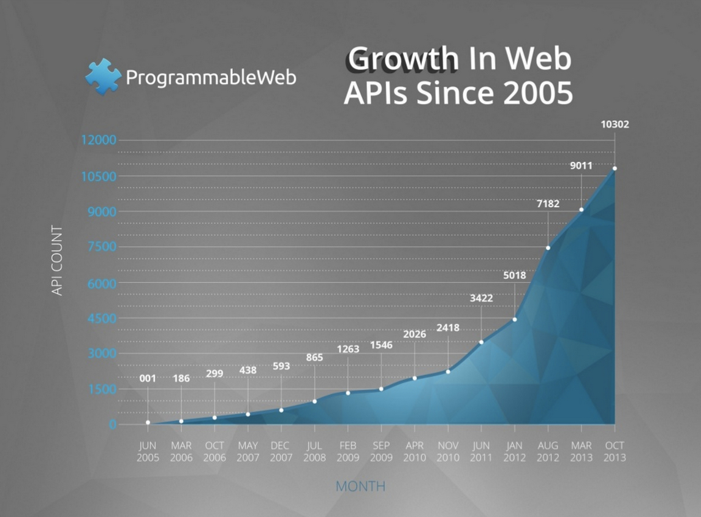
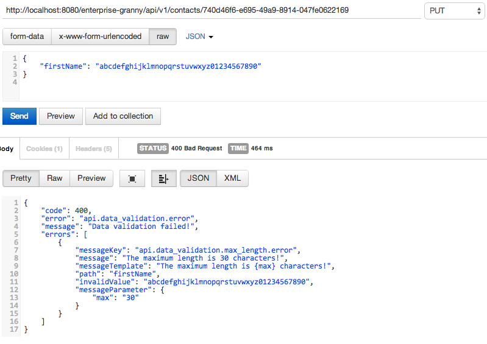

## The Road to API-ness

### Prologue

True... it's been a while since the last chapter, but patience is one of these virtues that come with age. Hence let's hope that Granny doesn't mind too much and get it on with. In the [last chapter](/doc/08.md) we talked about proper user interface design, both from an outside-in but also inside-out approach. I still believe that the later is the enabler for a good user experience (UX). It's a classic principle of software development: proper layering, separation of concerns and componentization help to fine-tune individual aspects as one does not need to worry to break other things.

Judging by the feedback I received it seems that people people believe that the time applications need to cater for ~~browsers~~ user-agents that do not support ~~JavaScript~~ aeh [ECMAScript ](http://en.wikipedia.org/wiki/ECMAScript)is past us and rather a relict of the past. (_"Common, we live in the 21st century!"_)

I'd say it depends on the usage scenario and I believe there are still use cases where people will have to implement such fallbacks (e.g. in the public sector etc.) As always, it's a case-by-case situation and the additional efforts required to maintain a solid fallback mechanism for limited user-agents certainly need to considered and planned for. Yet, given that the whole idea behind this blog series is to talk about what it takes to implement an enterprise-ready solution I at least wanted to point out how it's done! Going forward we'll certainly focus on state-of-the-art techniques to maximize the user experience and only maintain a rudimentary fall-back solution (after all, _convenience goes a long way_, and users may be encouraged to update to a modern browser if they feel they are missing out!)

Having said all this, it's time to have a look at current trends in user interface technologies. Doing so, we quickly notice that there's a tendency to let the client do the heavy-lifting. Technologies such as HTML5, JavaScript (see above) and CSS3 have progressed tremendously over the last years and it's amazing to see what capable developers can build with these web standards! On the mobile side we see both web and native apps deliver great user experiences and containers like [Cordova](http://cordova.apache.org/) (aka PhoneGap) completely blurry the lines between web and native apps. In both scenarios the client handles the user interaction and only communicates with the server/backend via web services (in the broader sense of the word!) Typically, this is done using light-weight communication protocols and standards such as [REST](http://en.wikipedia.org/wiki/Representational_State_Transfer) (e.g. [JSON](http://en.wikipedia.org/wiki/JSON) via HTTP) or - as popular at SAP and Microsoft - [OData](http://en.wikipedia.org/wiki/OData). Consequently, the server is responsible of providing an [API](http://en.wikipedia.org/wiki/API) that can be used by clients.

### _There's an API for that!_

I truly believe that in the context of cloud computing and the [Internet of Things](http://en.wikipedia.org/wiki/Internet_of_Things) (IoT) the famous slogan "_[There's an app for that!](https://www.youtube.com/watch?v=EhkxDIr0y2U)_" ([copyright by Apple Inc.](https://www.apple.com/legal/intellectual-property/trademark/appletmlist.html)) will change into "_There's an API for that!_" - APIs are really the foundation of the magic of today's inter-connected world.



Growth in Web APIs Since 2005 - Source: [ProgrammableWeb](http://www.slideshare.net/programmableweb/web-api-growthsince2005)

Given the importance I opted for giving this topic some extra room and actually write a mini series about APIs... yet before we dig deeper I'd like to point out that the term API does not necessarily indicate that the exposed services/functionality is consumed from the outside. In fact, I strongly promote of clearly establishing an internal API comprising the business functionality of any application. Software is never finished! As such, as applications grow over time it clearly helps to have defined an internal API layer that is used between the individual components or modules across the application. Exposing this set of services (or parts) of it in such a way that external clients can consume them is a completely different story - and one that comes with its own challenges!

I already wrote extensively about Enterprise APIs, why they matter, their primary principles and how-to develop them in my respective blog post series called '**The Rise of Enterprise APIs**':

*   [The Rise of Enterprise APIs - Part I](http://scn.sap.com/community/cloud/blog/2012/06/05/the-raise-of-enterprise-apis)
*   [The Rise of Enterprise APIs - Part II](http://scn.sap.com/community/developer-center/cloud-platform/blog/2012/08/02/the-rise-of-enterprise-apis--part-ii)
*   [The Rise of Enterprise APIs - Part III](http://scn.sap.com/community/developer-center/cloud-platform/blog/2012/08/03/the-rise-of-enterprise-apis--part-iii)

As I hate to repeat myself I just refer you to the respective posts and only briefly point out things I deem important to make a point. From an implementation perspective Granny's Addressbook uses the same building blocks as the sample application I developed for [part 3](/community/developer-center/cloud-platform/blog/2012/08/03/the-rise-of-enterprise-apis--part-iii) of the series: [Apache CXF](http://cxf.apache.org/) (as a great implementation of the [JAX-RS standard](http://en.wikipedia.org/wiki/Java_API_for_RESTful_Web_Services), [Spring](http://projects.spring.io/spring-framework/), etc.

### API = A set of self-contained services

The most important aspect of a business service that shall be included within an API is that it needs to be self-contained. For the client/consumers it has to act as a black box and ultimately a client would not need to know anything about the internal workings of the service. Consequently, the service may not take anything for granted (e.g. that the incoming data is in proper format or that it has been validated for type-safety or plausibility). As such, the service needs to properly check any incoming data for validity and properly report back any issues there may be. Same applies for security aspects etc. All of these aspects need to be ensured regardless of whether it was an internal or an external client consuming the service. That's the reason why I usually promote separating the underlying service from the actual API endpoint (which is protocol and format specific!)

This mindset is reflected in the architecture of the Granny's Addressbook application. The [com.sap.hana.cloud.samples.granny.srv](https://github.com/SAP/cloud-enterprise-granny/tree/master/src/main/java/com/sap/hana/cloud/samples/granny/srv) package contains the actual service implementations, which are just regular Java classes. They use the standard data model objects of the application and declare to throw a dedicated [ServiceException](https://github.com/SAP/cloud-enterprise-granny/blob/master/src/main/java/com/sap/hana/cloud/samples/granny/srv/ServiceException.java). The RESTful API however is located in a different package called: [com.sap.hana.cloud.samples.granny.api](https://github.com/SAP/cloud-enterprise-granny/blob/master/src/main/java/com/sap/hana/cloud/samples/granny/api/). If you have a closer look at the so-called [Facades](http://en.wikipedia.org/wiki/Facade_pattern) within this package you will see that they contain certain meta information (annotations) that are specific to RESTful service communication (and part of the JAX-RS API.) Same is true for the `Response` objects returned by the individual service methods. This differentiation also takes effect in regards to error handling. The service needs to take care of all business related concerns, while the (REST) facade needs to make sure it properly handles issues that may arise during the process of [marshalling](http://en.wikipedia.org/wiki/Marshalling_(computer_science))/unmarshalling the data model objects into JSON (or any other format). Let's keep that in mind as we get back to that topic in a few...

### The three commandments of a good API

One could write a while book about what makes a good API, yet I leave that for others and simple state three fundamental characteristics here:

*   easy to consume
*   well documented
*   good error handling

That's really it! If an API fails to adequately address these things it will have a hard time to see adoption. And - quite frankly - if your API is part of a service targeting adoption you better nail does three things or...

#### Easy to consume

This factor has been the main reason why RESTful services have taken the IT world by storm in the last years. Due to the fact that RESTful services simply sit on top of the matured HTTP protocol makes them very easy to consume (especially compared to prior standards such as [Web Services](http://en.wikipedia.org/wiki/Web_services) (I'm referring to the kind based on SOAP and WS* standards here...). Developers can test-drive RESTful APIs with their browsers or light-weight REST clients with ease. (Personally, I prefer a tool called [POSTman](http://www.getpostman.com/).)

#### Well documented

This is a _make or break_ topic - PERIOD. Your documentation needs to be easy to find and easy to understand. Developers are an impatient bunch and never have enough time to deliver within tight project deadlines. If they are struggling with how-to consume your API then they may just move on to a competitor - simple as that. Now, the hard part about maintaining a good API is actually **maintaining** it!

Way too often the documentation gets outdated, especially if it is written by a different team (which is quite common!) In general, information experts are under-valued and consequently service/API providers are well-advised to invest into a great documentation team that has both writing and technical skills. Ultimately, you regularly validate ease-of-consumption of your documentation via user tests!

Ultimately, you are well advised to consider the documentation an integral part of your product/service/solution and tightly weave it into your development &amp; delivery processes! In fact, one of the next chapters of this series will focus on exactly that topic - so stay tuned!

#### Good error handling

Last, but not least: error handling (everyone's favorite topic, right?) From experience I can say that there's nothing more frustrating than _struggling_ with an API because of poor error messages. If a developer can't figure out what (s)he has done wrong in consuming your API then you have a problem!

Here's where the dots connect in regards to what I said earlier about self-contained services. Given the importance of the topic I propose we have a closer look at it now, shall we?

### Catch me if you can!

As always, we want to deal with error handling in a central place. Yet, in reference to what we said earlier we have two different flavors of errors to deal with. Semantical errors (e.g. constraint violations such as an exceeded maximum length of a given attribute) and technical errors (e.g. invalid payload data or formatting issues.) The former needs to be taken care of by the business services, while the later needs to be taken care of by the layer that handles the incoming/outgoing communication. In the case of Granny's Addressbook the in- an outbound communication is handled by [CXF](https://cxf.apache.org/) and the JSON marshalling/unmarshalling is taken care of by [Jackson](http://jackson.codehaus.org/). Fortunately, this combination allows us to nicely implement our requirements (and that's what makes a good framework after all!)

Let's see how this works by looking at the code (= the single source of truth!). Below is an extract of the [spring conifguration file](https://github.com/SAP/cloud-enterprise-granny/blob/master/src/main/webapp/WEB-INF/spring/root-context.xml):

```xml
<jaxrs:server id="api" address="/v1">  
  <jaxrs:properties>  
            <entry key="org.apache.cxf.propagate.exception" value="false" />  
        </jaxrs:properties>  
  <jaxrs:serviceBeans>  
  <ref bean="contactFacade" />  
  </jaxrs:serviceBeans>  
  <jaxrs:providers>  
            <ref bean="jacksonProvider" />  
            <ref bean="parserExceptionMapper" />  
            <ref bean="jsonMappingExceptionMapper" />  
            <ref bean="serviceExceptionMapper" />  
        </jaxrs:providers>  
 </jaxrs:server>  
 <bean id="objectMapper" class="com.sap.hana.cloud.samples.granny.util.CustomObjectMapper" />  
 <bean id="jacksonProvider" class="org.codehaus.jackson.jaxrs.JacksonJaxbJsonProvider">  
  <property name="mapper" ref="objectMapper"/>  
 </bean>  
  <!-- Exception Mappers -->  
 <bean id="parserExceptionMapper" class="com.sap.hana.cloud.samples.granny.web.util.ParserExceptionMapper" />  
 <bean id="jsonMappingExceptionMapper" class="com.sap.hana.cloud.samples.granny.web.util.JsonMappingExceptionMapper" />  
 <bean id="serviceExceptionMapper" class="com.sap.hana.cloud.samples.granny.web.util.ServiceExceptionMapper" />  

```


In lines 10-12 I register so-called `ExceptionMappers` defined in lines 23-25. We have two `ExceptionMappers` taken care of the most common areas during the marshalling/unmarshalling process (namely parsing and mapping) and one `ExceptionMapper` taking care of [ServiceExceptions](https://github.com/SAP/cloud-enterprise-granny/blob/master/src/main/java/com/sap/hana/cloud/samples/granny/srv/ServiceException.java). Just as it should be!

I recommend to have a look at the [ParserExceptionMapper](https://github.com/SAP/cloud-enterprise-granny/blob/master/src/main/java/com/sap/hana/cloud/samples/granny/web/util/ParserExceptionMapper.java) and [JsonMappingExceptionMapper](https://github.com/SAP/cloud-enterprise-granny/blob/master/src/main/java/com/sap/hana/cloud/samples/granny/web/util/JsonMappingExceptionMapper.java) respectively. They should be pretty self-explanatory for the most part, yet I'd like to explicitly mention one aspect I deem important - we have to strike a good balance between level of detail and usefulness, plus not expose too many details about the underlying technology stack (for security reasons!) Therefore, I have used a bit of [regex](http://en.wikipedia.org/wiki/Regex) magic to conceal certain internal aspects.

**Note:** This approach certainly has its trade-offs! Given that we (more or less) pass-through the error messages provided by Jackson we are not in control of its content. Nor can we apply any kind of I18N and so forth. This certainly is an edge case and in a real-world application we certainly have to thoroughly test this piece of functionality with a lot of test cases to make sure the effect is as desired. Or, we would need to map the Jackson error message to our own and then return our own error messages. Whatever you decide to do, it should be a conscious decision!

### 1st-level data validation

So, now that the parsing and mapping has been dealt with - what about 1st level data validation (e.g. type-safety, mandatory fields, min/max lengths, etc.) Given on what I said above about self-contained services this certainly is something that should be dealt with by the service layer, right? The answer is a clear "_YES, but..._"

... does it make sense to pass through unvalidated data to the next layer, or shouldn't this be checked early-on? That's a tricky question! We could check the data here as well, by just adding the same `@Valid` annotation we use in the service layer. This would help to make the app more scaleable as we would reject invalid data at the earliest time in the request processing. Given that we have clearly separated the validation logic we at least can ensue a consistent handling of data validation. On the other hand, the first rule still stands and so the individual services would still need to verify the incoming data, consequently resulting in a redundant check (= performance overhead).

### Internal vs external APIs

Matter of fact, that brings us to another topic. Assume we have a complex application with lots of services, of which some are just business facades chaining several calls to other business services. In such an application we would see repetitive calls to the data validation functionality! This is where you have to set boundaries and differentiate between internal services and external services. Among the former you'd have to assume that the data is semantically correct and would not need to be verified, while for the later you'd always want to ensure proper data validation.

**Note**: I recall having developed such a complex application and we ended up with developing our own set of annotations that would allow us to setup trust relationships between individual services in order to avoid redundant checks. In a nutshell the solution used [ThredaLocals](http://java.dzone.com/articles/java-thread-local-%E2%80%93-how-use) to store information about which model objects have been validated (and by whom). Every subsequent service then checked if the incoming model object had been validated and whether or not it had been validated by a trusted service or not. Now, obviously certain attributes could be changed along the processing chain and consequently data that once was valid, may not be valid anymore when it is passed to another service. This is where checksums may need to come into place. Sooner or later you end up with a complex meta-validation framework in its own right and well... that may do more harm than good!!!

So, on which layer to perform your data validation needs to be decided on a case-by-case basis. For **Granny's Addressbook** (which is a very simple) application it may be sufficient to simply do the data validation on the service layer, especially since our RESTful facades are rather thin. However, for the sake of illustration purposes I'll demonstrate how-to check data on the RESTful API layer AND on the service layer. That way, you have a blueprint for both and you can decide on your own which way to go with for your project.

### Apache CXF and JAX-RS 2.0

Recently, [CXF version 3.0](http://cxf.apache.org/docs/30-migration-guide.html) was released and it marks a huge milestone as it also brought support for [JAX-RS 2.0](https://jcp.org/aboutJava/communityprocess/final/jsr339/index.html). JAX-RS 2.0 is a major step and it brings a lot of new features we eagerly waited for such as hypermedia support (for the die-hard [HATEOAS](http://en.wikipedia.org/wiki/HATEOAS) fans out there!) and ... surprise, surprise... bean validation.

Here's the official documentation on how-to integrate bean validation into CXF: [Apache CXF -- ValidationFeature ](http://cxf.apache.org/docs/validationfeature.html "http://cxf.apache.org/docs/validationfeature.html")

We pretty much stick to these instructions, yet there is one short-coming in how CXF handles this aspect: the default [ValidationExceptionMapper](http://cxf.apache.org/javadoc/latest-3.0.x/org/apache/cxf/jaxrs/validation/ValidationExceptionMapper.html) is rather _dumb_ as it only logs the validation errors and returns an [HTTP status code 400](http://en.wikipedia.org/wiki/List_of_HTTP_status_codes#4xx_Client_Error) (Bad request). Ultimately we would want to provide that information back to the client to give the user a hint what is wrong. (Note: For the SAP/ABAP guys out there, we are looking for something like a [BAPIRET2](http://help.sap.com/saphelp_nw04/helpdata/en/a5/3ec9f74ac011d1894e0000e829fbbd/content.htm)<span style="font-size: 10pt;"> structure here!)  

The Jersey (another popular JAX-RS implementation) is a bit smarter here: 
[Chapter 17 - Bean Validation Support](https://jersey.java.net/documentation/latest/bean-validation.html#d0e12344 "https://jersey.java.net/documentation/latest/bean-validation.html#d0e12344")

Here's our own [ValidationError](https://github.com/SAP/cloud-enterprise-granny/blob/5bc487699c04cfb582f5e0486513efe002983b23/src/main/java/com/sap/hana/cloud/samples/granny/model/ValidationError.java) object:

```java
@XmlRootElement(name = "error")
@XmlAccessorType(XmlAccessType.FIELD)
public class ValidationError implements Serializable
{
    /**
	 * The <code>serialVersionUID</code> of the class.
	 */
    private static final long serialVersionUID = 1L;

    String messageKey = null;
    
    String message = null;
    
    String messageTemplate = null;
    
    String path = null;
    
    String invalidValue = null;
    
    Map<String, String> messageParameter = null;

    ...
}
```

### Code Review

So, to wrap up things, let's quickly go through the major components and see how it all fits together and to highlight a few coding segments. Let's start with the final [spring configuration](https://github.com/SAP/cloud-enterprise-granny/blob/5bc487699c04cfb582f5e0486513efe002983b23/src/main/webapp/WEB-INF/spring/root-context.xml):

```xml
<jaxrs:server id="api" address="/v1">    
    <jaxrs:inInterceptors>
        <ref bean="validationInInterceptor" />
    </jaxrs:inInterceptors>
    <jaxrs:outInterceptors>
        <ref bean="validationOutInterceptor" />
    </jaxrs:outInterceptors>
    <jaxrs:properties>
        <entry key="org.apache.cxf.propagate.exception" value="false" />
    </jaxrs:properties>
    <jaxrs:serviceBeans>
        <ref bean="contactFacade" />
    </jaxrs:serviceBeans>
    <jaxrs:providers>
        <ref bean="jacksonProvider" />
        <ref bean="parserExceptionMapper" />
        <ref bean="jsonMappingExceptionMapper" />
        <ref bean="serviceExceptionMapper" />
        <ref bean="validationExceptionMapper" />
    </jaxrs:providers>
</jaxrs:server>
```

At first (lines 2-7) we register both an inbound and an outbound interceptor (well, for our data validation purposes we only need the inbound one!) Also, note that we registered an additional `ValidationExceptionMapper` as a provider (line 19).

The respective definitions are as follows:

```xml
    <bean id="validationExceptionMapper" class="com.sap.hana.cloud.samples.granny.web.util.ValidationExceptionMapper" parent="constraintViolationMapper" />
	
	<!-- Validation -->	
	<bean id="validationProvider" class="org.apache.cxf.validation.BeanValidationProvider">
  		<constructor-arg><ref bean="validationConfiguration"/></constructor-arg>
	</bean>
	
	<bean id="validationConfiguration" class="org.apache.cxf.validation.ValidationConfiguration">
		 <property name="messageInterpolator" ref="resourceBundleMessageInterpolator"/>
		 <property name="parameterNameProvider" ref="jaxRSParameterNameProvider" />
	</bean>
		
	<bean id="resourceBundleMessageInterpolator" class="org.hibernate.validator.messageinterpolation.ResourceBundleMessageInterpolator">
    <constructor-arg index="0">
        <bean class="org.springframework.validation.beanvalidation.MessageSourceResourceBundleLocator">
            <constructor-arg index="0" ref="messageSource"/>
        </bean>
    </constructor-arg>
	</bean>
	
	<bean id="jaxRSParameterNameProvider" class="com.sap.hana.cloud.samples.granny.web.util.CustomJAXRSParameterNameProvider" />
 
	<bean id="validationInInterceptor" class="com.sap.hana.cloud.samples.granny.web.util.CustomJAXRSBeanValidationInInterceptor">
	    <property name="provider" ref="validationProvider" />
	</bean>
	 
	<bean id="validationOutInterceptor" class="org.apache.cxf.jaxrs.validation.JAXRSBeanValidationOutInterceptor">
	    <property name="provider" ref="validationProvider" />
	</bean>
```

On line 1 we define the [ValidationExceptionMapper](https://github.com/SAP/cloud-enterprise-granny/blob/5bc487699c04cfb582f5e0486513efe002983b23/src/main/java/com/sap/hana/cloud/samples/granny/web/util/ValidationExceptionMapper.java), which encapsulates the JAX-RS specific interface of `ExceptionMapper<Throwable>`. Most of the heavy lifting of converting [ViolationConstraints](http://docs.oracle.com/javaee/6/api/javax/validation/ConstraintViolation.html) to [ValidationErrors](https://github.com/SAP/cloud-enterprise-granny/blob/5bc487699c04cfb582f5e0486513efe002983b23/src/main/java/com/sap/hana/cloud/samples/granny/model/ValidationError.java) is actually taking care of by the parent class: [ConstraintViolationMapper](https://github.com/SAP/cloud-enterprise-granny/blob/5bc487699c04cfb582f5e0486513efe002983b23/src/main/java/com/sap/hana/cloud/samples/granny/util/ConstraintViolationMapper.java). The primary reason for splitting it up into two classes is clean separation between a cross-cutting concern (data validation) and the (RESTful) API layer.

Lines 8-11 define the configuration for the validation framework. Here, we register our own `JAXRSParameterNameProvider` and a `MessageInterpolator`. Both are required to massage the information reported back as `ValidationErrors`, e.g. looking up the right resource bundle containing our validation messages and providing proper information about the invalid attribute.

In lines 23-25 we register the inbound validation interceptor. Please note that this is yet another [custom implementation](https://github.com/SAP/cloud-enterprise-granny/blob/5bc487699c04cfb582f5e0486513efe002983b23/src/main/java/com/sap/hana/cloud/samples/granny/web/util/CustomJAXRSBeanValidationInInterceptor.java) (based on the standard one of course), which comes with a slightly different approach of validating the incoming data. The main reason for the custom implementation was to ensure a similar handling of data validation regardless of whether it happens on the API or the service layer.

### Last words

Now, as mentioned several times already we still need to ensure that the service layer is also validating the incoming data. This is done via a corresponding Aspect: [DataValidationAspect](https://github.com/SAP/cloud-enterprise-granny/blob/master/src/main/java/com/sap/hana/cloud/samples/granny/xcc/DataValidationAspect.java).

With that, we conclude this chapter by looking at the result:



Hope you liked our first post about the "**Road to API-ness**" and that you tune back in next time when we talk about API documentation. Soo long...
</body>