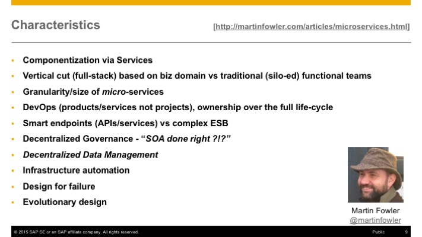
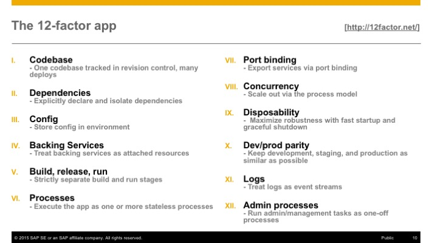

## Granny 2.0 - A new Beginning

### Microservices on SAP HANA Cloud Platform

When talking about the value of cloud the conversation has long shifted from cost reduction (plus moving from capital to operational expenses) to business agility. In order to gain or keep a step ahead of the competition it's vital for companies large and small to be able to quickly roll out new and innovative solutions. As such, unprecedented time-to-market and inherent scaling capabilities are the key strengths associated with cloud these days and within that context the topic that gets the most attention these days is [microservices](http://wikipedia.org/wiki/microservices).

To those not yet familiar with the term or its general meaning I'd recommend reading the correspondent document written by James Lewis and Martin Fowler: [Microservices](http://martinfowler.com/articles/microservices.html). From a technical point of view the main idea is to break down large(r) software systems into smaller autonomous services that are loosely-coupled and which communicate with each other using remote protocols (in contrast to local in-memory invocation). It's the opposite of a monolithic architecture, which has the tendency to become so complex over time that one can no longer rapidly make changes or develop new features without the risk of unintentionally breaking individual parts or even the whole system altogether!

 

While the whole notion of Microservices is independent from a specific technology by design (!!!), it is easy to spot some shared ideas and concepts with their close kin - [SaaS](https://en.wikipedia.org/wiki/Software_as_a_service). In this context, the concept of a [12-factor app](http://12factor.net/) has become a widely accepted stereotype and architectural guideline for cloud applications and both stress the importance of a respective organisational setup (team owns the entire life-cycle from idea to operation) and [DevOps](https://en.wikipedia.org/wiki/DevOps) (incl. continuous delivery).

It is easy to see how Microservices and Platform-as-a-Service (PaaS) go hand-in-hand and some go even further calling "_cloud the natural habitant for Microservcies_" (Reference: [Stefan Tilkov, InnoQ](https://www.innoq.com/blog/st/2015/06/dont-start-with-a-monolith/)). Consequently, I was intrigued by the idea to demonstrate how-to develop Microservices on the SAP HANA Cloud Platform during this year's SAP TechEd.

[**Presentation**](http://www.slideshare.net/saphcp/dev300-architecture-guidelines-for-microservices-based-on-sap-hana-cloud-platform)(http://www.slideshare.net/saphcp/dev300-architecture-guidelines-for-microservices-based-on-sap-hana-cloud-platform)  
[**Recording**](http://events.sap.com/teched/en/session/22720 "http://events.sap.com/teched/en/session/22720")

The corresponding source code is now the new master branch (2.x) of the **Enterprise Granny** sample application:[https://github.com/SAP/cloud-enterprise-granny](https://github.com/SAP/cloud-enterprise-granny "https://github.com/SAP/cloud-enterprise-granny")

For all those interested to dig deeper ... the Enterprise Granny series will continue to highlight and discuss key aspects mentioned in the presentation and even go beyond these topics. So, if that's your cup of tea make sure to subscribe to the repo to get notified of changes!

_Happy coding everyone!_