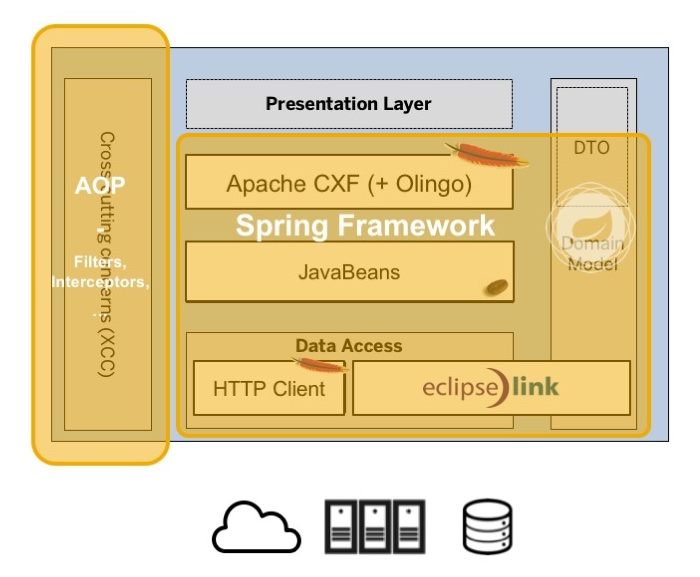

## Granny 2.0 - A new Beginning - Part II

### An exemplary blueprint for a microservice architecture

As stated in my [last blog post](/20a.md) I believe there are many shared characteristics of cloud (native) applications and microservices, which is why I opted for using a refactored version of the _Granny_ application as the baseline for an exemplary microservice architecture blueprint rather than starting from scratch.

> **NOTE:** Please note that we called it an _exemplary_ microservice architecture blueprint. By definition, microservices are independent of any specific technology or programming language and hence there's no such thing as one-size-fits-all template or anything like that. The provided blueprint is *just* something that has been proven to work for the author in numerous enterprise-scale projects, but please don't mistake it for the one and only architceture approach!

During the course of this post we'll elaborate on the basic components of this architecture blueprint and discuss the pros and cons of each design consideration taken.

### General structure

The refactored _Granny_ application consists of three ([Maven](https://maven.apache.org/)) sub-modules:

+ a shared `enterprise-granny-core` module, which contains the domain model and the API,
+ a (micro-) service (provider) called `enterprise-granny-service` and
+ an exemplary client application called `enterprise-granny-client`

Of course one could argue that the core and the service (provider) module could be merged into one and that the client is an optional component - and rightly so! But then, given we provided a user interface in the original version it didn't feel right to deprecate it now... after all a lot of the previous posts in this series covered UI-related topics. Furthermore, we consider it a common case that there's a central UI component (or application) that leverages the individual microservices and as such it makes sense to provide an example of that as well.

A common question is also why we stick to this *old-fashioned* approach of using a classic (Java) web application instead of a Javascript based MVC framework as it is en vogue these days! Great question, thanks for asking!

Well, when reading about the fundamental characteristics of microservices, sooner or later the topics of _resilience_, _fault-tolerance_ and how-to cope with _latency isues_ are brought up. In this context, the [Hystrix](https://github.com/Netflix/Hystrix) project from [Netxflix](https://github.com/Netflix/) seems to establish itself as a standard - at least in the Java space. Now imagine you have a UI (or application) that interacts with a lot of (micro-)services. Of course you could do that directly via Javascript (e.g. jQuery or other frameworks), but then you would also have to cope with the above mentioned topics using Javascript. And while there seem to be [circuit breaker](https://en.wikipedia.org/wiki/Circuit_breaker_design_pattern) implementations in Javascript available out there, but I'm just not convinced that's the right choice! So, if that kind of thinking makes me 'old-fashioned', then so be it... 10+ years of making a living as a software architect have taught me that it is always good to have a level of indirection - just in case! Consequently, we stick to a classic Java web application for the presentation layer/UI.

Before we dig deeper, let's briefly discuss the purpose of the _core_ module. True, the _service_ exposes a RESTful API and this is how _clients_ interact with the service. Now, imagine that one of the clients would be a Java application as well; wouldn't it be so much more convenient to use a Java API than having to use the low-level HTTP communication including JSON (de-) serialization etc. As such, we have 'out-sourced' the domain model and the interfaces of the microservice so that it can be reused by the client to interact 'natively' with the service using a Java-based API (instead of a REST-based one).

### Architecture blueprint

 

The illustration above shows the general architecture blueprint we are promoting as one potential candidate for your own microservice implementations. True, it does indeed look like the typical n-tier architecture used for decades now! At this point, I'd like to refer you back to the [Zef Hemel](http://zef.me/about) quote I've used in my [Cloud Platform Play](http://scn.sap.com/community/cloud/blog/2013/05/03/the-cloud-platform-play) presentation:

> _"Build amazing apps with the most boring technology you can find. The stuff that has been in use for years and years."_ - _Zef Hemel_ in [Pick your battles](http://zef.me/4235/pick-your-battles)

Those familiar with the original _Granny_ application will see immediately that there have been no changes to the libraries and frameworks used. We have discussed many of them in great detail during the course of the blog post series that complement the _Granny_ application. Still, it sounds valid to quickly summarize it all and explicitly point out reasons why we believe that a particular library or framework is a good choice from a microservice architecture viewpoint.

The general building blocks are as follows:

+ plain old Java objects (aka [POJOs](https://en.wikipedia.org/wiki/Plain_Old_Java_Object)) for the domain model and business logic
+ [Apache HTTP Client](http://hc.apache.org/) for HTTP-based communication
+ [EclipseLink](http://www.eclipse.org/eclipselink/) as the [JPA](https://en.wikipedia.org/wiki/Java_Persistence_API) implementation of choice
+ [Apache CXF](https://cxf.apache.org/) for exposing the RESTful API
+ (optional) [Apache Olingo](https://olingo.apache.org/) in case you want to expose your API using OData
+ [Spring](http://projects.spring.io/spring-framework/) (framework) as the over-arching programming model and [DI-container](https://en.wikipedia.org/wiki/Dependency_injection) plus some additional Spring projects ([Spring Data JPA](http://projects.spring.io/spring-data-jpa/), [Spring Cloud Connectors](http://cloud.spring.io/spring-cloud-connectors/), ...) to simplify various aspects of the application (more on that later-on)
+ [AOP](https://en.wikipedia.org/wiki/Aspect-oriented_programming) to 'out-source' [cross-cutting concerns (XCCs)](https://en.wikipedia.org/wiki/Cross-cutting_concern) as `Aspects` and hereby separating them from the core business logic

So, let's go through them one-by-one...

#### Business logic

Personally, I'm strongly advocating to use POJOs for the domain model and business logic services as it ensures that this layer remains very light-weight and easy to maintain. It also makes unit testing a breeze! Given that the whole point of using microservices is to gain/keep business agility being able to quickly roll out new versions is fundamental. For that your team needs to embrace [continuous delivery](https://en.wikipedia.org/wiki/Continuous_delivery), ergo - solid test coverage is a must to ensure stability and quality of your microservices over their entire lifetimes. Last, but not least POJOs usually have little or no dependencies at all (well, besides maybe [Apache Commons](https://commons.apache.org/) or the like).

#### Connectivity

Truth be told... the `java.net` library is a pain to use and because of that the [Apache HTTP Components](http://hc.apache.org/) have sort of become the de-facto standard library for HTTP-based communication. Many other frameworks and libraries build on top of Apache HTTP Components. This makes it the obvious choice for our blueprint, but there's more. Apache HTTP Components is also a first-class citizen within the classic Java runtime or SAP HANA Cloud Platform (aka NEO): e.g. the `Connectivity API` and `Destination API` make use of this library (see [Online documentation](https://help.hana.ondemand.com/help/frameset.htm?e69bc863bb571014b358e2947e36d475.html). This integration allows it to *pass-through* the currently logged-on user of a web/cloud application all the way down to the backend systems, which is a common requirement in enterprise software projects (e.g. for general auditing, [SOX](https://en.wikipedia.org/wiki/Sarbanes%E2%80%93Oxley_Act) compliance).

#### Persistence

Next stop: persistence. Over the years the [Java Persistence API](https://en.wikipedia.org/wiki/Java_Persistence_API) has matured and [EclipseLink](http://www.eclipse.org/eclipselink/) is a powerful implementation of this standard. Since version 2.5 it ships with built-in support for [SAP HANA](https://wiki.eclipse.org/EclipseLink/Development/DatabasePlatform/HANAPlatform), which comes in handy of course. ;) Furthermore, Eclipselink also support two unique extensions to the JPA standard namely [optimistic locking](https://wiki.eclipse.org/EclipseLink/Features/JPA#Optimistic_Locking) (which is the only scalable approach of handling high concurrency) and [multi-tenancy](https://wiki.eclipse.org/EclipseLink/Examples/JPA/Multitenant). Last, but not least JPA itself is quite unobtrusive, which frees us from having to introduce a dedicated persistence model next to the domain model.

#### API Layer

One of the main characteristics of a microservice architecture is the provisioning of a ([RESTful](https://en.wikipedia.org/wiki/Representational_state_transfer)) API. In the Java space, there's a standard for that called [JAX-RS](https://en.wikipedia.org/wiki/Java_API_for_RESTful_Web_Services). [Apache CXF](https://cxf.apache.org/) is an implementation of this standard. And while there are also other popular alternatives (such as the JAX-RS reference implementation [Jersey](https://jersey.java.net/)) we opted for CXF for a variety of reasons:

+ its modular design (reads: flexibility)
+ its support for not only JAX-RS, but also [Web Service standards](https://en.wikipedia.org/wiki/Web_service), which is still a a common requirement in enterprise software projects
+ a strong community backing it

> **NOTE:** In case you intend to also provide an OData-based API you may want to look into [Apache Olingo](https://olingo.apache.org/).

#### Programming model

I've been a big fan of the [Spring framework](http://projects.spring.io/spring-framework/) for a long time and it's still my _weapon of choice_. True, some concepts such as the extensive XML configuration files have evolved since the early days and the annotation-based alternative is recommended these days, but what is more astonishing is that Spring (and its many sub projects) are still going strong!

> **Side note:** I'm sure that sooner or later we'll touch upon [Spring Boot](http://projects.spring.io/spring-boot/) in this series!

Besides the general strong sides of using a [DI-container](https://en.wikipedia.org/wiki/Dependency_injection) and the flexibility it brings there are many of reasons why I still consider Spring a great choice:

+ [Spring Data JPA](http://projects.spring.io/spring-data-jpa/): we touched upon that in episode 3 - [The Good, the Bad and the Ugly](/03.md)
+ [Spring Cloud Connectors](http://cloud.spring.io/spring-cloud-connectors/): ultimately, this is what makes our app/service PaaS-agnostic as explained in episode 11 - [One for All](11.md)

#### Aspect-oriented Programming

We touched the topic of [AOP](https://en.wikipedia.org/wiki/Aspect-oriented_programming) in episode 3 - [The Good, the Bad and the Ugly](/03.md) already and the arguments still apply! What I like in particular about the usage of aspects is that it keeps the main business logic clean and uncluttered - all the cross-cutting concerns like logging/tracing, authentication and authorization checks, input validation etc. are handled centrally and outside of the main business logic methods. This way, the business logic code is as easy to read, understand and maintain as possible - ultimately catering to our number one good: business agility!

### Wrap-up

So, with that we conclude our architecture review - I hope you found it worthwhile. Of course, we were only able to scratch the surface and re-iterate on some of the design considerations we discussed in earlier episodes. As such, those interested to get to the essence of it may want to read through the series (again).

Going forward we'll continue to have plenty of fun with **Granny** and multi-tenancy and the introduction of a circuit-breaker are only two examples of what's in our backlog. Furthermore, we'll also touch upon some of the topics related with operation of microservices such as rolling updates and continuous database refactoring using [Liquibase](http://www.liquibase.org/)...

Hope to see you around!
